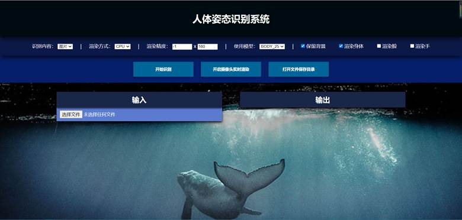
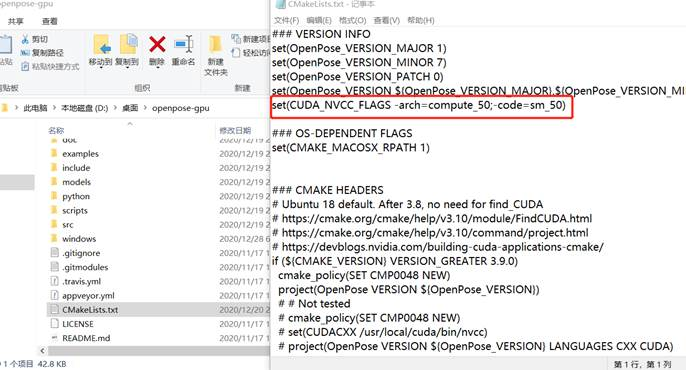
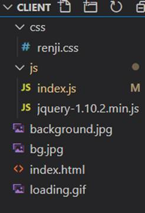
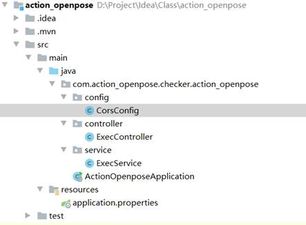
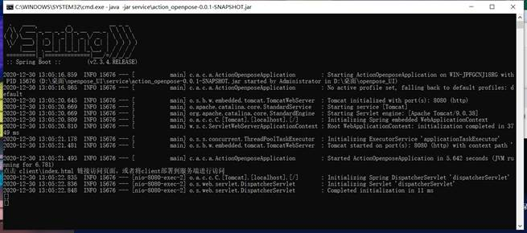
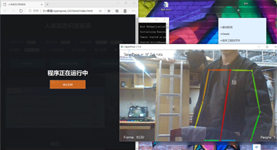

# Openpose UI

> openpose项目地址: https://github.com/CMU-Perceptual-Computing-Lab/openpose
>
> 项目运行环境：
>
> ​	 Service端：windows系统（本人是win10），cuda，cudnn，gpu算力5.0（因为个人技术原因，在编译时锁定成了该算力，如果有需求或有能力，可自行重新编译openpose的版本或将bin目录的openpose置换为openpose官方版本/个人可运行版本）；
>
> ​	 Client端：谷歌浏览器；
>
> 该项目运行需要Openpose的模型支持与相应的dll库文件；
>
> 训练模型可以通过`openpose_UI\models\`目录下的`getModels.bat`或`getModels.sh`进行获取(此方法下载极慢)，或者通过 https://www.aiuai.cn/aifarm708.html 该博客中的下载地址下载；
>
> dll库文件由于文件过大，并没有上传至仓库，我将其压缩发到和彩云网盘，供大家下载 链接: https://caiyun.139.com/m/i?105Cq6zrUjzEy  提取码:AkpZ，此外还可下载openpose官方网站中的发布的windows版本，将其中的dll复制进`openpose_UI\bin\`目录下即可；
>
> 

## 目录

[toc]

## 项目简介

- Openpose UI是为Openpose项目简单设计的一个B/S架构的交互界面，前端由基本的html、css、JavaScript与jqury实现，后端通过spring boot构建基本的访问、Process类进行对Openpose的调用。
- 自评：
  - 该项目主要在前端针对交互方面做出了一些设计，后端的技术使用的比较乱且不恰当，且没有真正的使用到Openpose的接口，仅仅是使用Process类对命令行的输入进行简化的操作；
  - 对于人机交互的主题而言，做到了对Openpose的基本操作的简化，在界面设计上花了一些心思；对于Openpose的主题而言，项目提供比较简易的Openpose基础功能的交互，但没有深入Openpose的技术底层进行使用；
- 该项目为本人在大三上学期的 人机交互 课程的课程设计项目，个人工作为
  - 后端的全部代码与设计
  - 前端的界面设计与功能实现
- 以下内容为该项目的课程实验报告，作为该项目的简单展示；

---

## 界面设计分析

### 主题界面

### 设计简述

- 配色和背景

  > 采用从上到下的递减的深蓝色，与背景的深海相呼应，背景寓意着openpose的前景与发展空间犹如深海一般无穷无尽，其能力如鲸鱼一般巨大无比。

- 样式

  > 用了很多的阴影去使得页面具有层次感，更符合深海的主题，同时，选项栏和按钮栏具有吸顶功能，主页面栏的输入输出列表有收缩功能；页面从上到下依次为 标题栏，选项栏，按钮栏，主界面栏
  - 标题栏：简单的项目标题，黑底白字更为醒目

    

  - 选项栏：选项栏为运行openpose时的一些配置选项，

    

  - 按钮栏：作为几个功能的启动口，可以启动对应的功能

    

  - 主页面栏：由输入框和输出框组成，其中输入框包括 选择文件按钮，列表 ，预览框；输出框只包括 列表，预览框；

    - 为了方便查看运行的输入和输出，将输入框输出框设计为左右结构，而预览框则设计在列表下方；并为列表添加了收缩的功能

      

- 页面动效与反馈

  - 页面进行了自适应处理，可以应对不同分辨率的机器与不同的缩放比例，其中，如果页面宽度过小，输出框会自动换行到下半部分，下面的演示中的手机页面部分可以完整看到该效果；

    > (以下操作均在win10系统的chrome浏览器的对应展示结果，机器分辨率为：1920 x 1080)

    - 在我的机器上的正常比例

      

    - 缩放67%

      

    - 缩放150%（放大）

      

    - 正常分辨率下的窄宽

      

    - 手机模式：

      

  - 按钮栏和选项栏作为主要功能，于是添加了吸顶的功能，当页面下拉到很下方的区域，这两个功能栏将会直接吸附在页面最上方，保证无论在页面的什么位置都可以轻松的操作对应的功能

    

  - 鼠标经过按钮与列表时有高亮反馈

    

    

  - 列表可以进行收缩

    - 收缩前：

      

    - 收缩后：

      

  - 程序运行时会出现遮罩让用户进行等待或取消当前操作

    

---

##  开发中遇到的问题

### openpose的编译

Openpose具有cpu和gpu版本，cpu版本通过下载好的caffe模型在虚拟机中成功编译并跑通；

Openpose的GPU版本的编译需要有cuda和cudnn的支持，在虚拟机环境下无法操作，在win10环境下要使用cmake编译后再通过visual studio进行进一步编译成exe文件;

其中,cuda和cudnn依赖于显卡的算力，编译过程中，openpose的默认设置下无法识别对应机器的算力，导致编译后算力不匹配无法运行；最终找到的解决方案为：

修改CMakeLists.txt 将算力设置为当前机器的算力（我这里是5.0）

### openpose的运行

Openpose对机器的要求较高，无法通过默认方式运行，我机器以默认方式运行会内存不足；更进阶的识别面容和五指功能更加无法使用；解决方案：

根据github上的readme文档，添加对应的参数减小精度，减少内存需要，可以运行基本的功能，由于机器的配置太低，尽管将精度减小，面容识别和五指识别的额外功能仍旧无法在我的机器上运行；

### 界面实现技术选型

Openpose在windows下使用c++实现，并有对应的python接口，但我们小组对c++和python的了解不多，特别是界面可视化方面毫无接触，于是使用我们比较熟悉的Java进行命令调用，然而考虑到java本身的界面编写也不太熟悉，我们采用了B/S架构的java web模式开发；

### web开发中的问题

整个项目采用B/S架构，前端采用基本的html+css+JavaScript，并引入jqury.js简化操作；后端选用springboot+spring MVC进行快速开发；

前端的实现中，由于安全原因无法通过浏览器获取本地文件的路径，解决方法：直接通过文件上传的方式将要处理的文件上传到后端进行保存，获得文件保存在后端的路径；（后面发现，如果前端页面不部署在其他机器进行跨域访问则可以获得本地文件的路径）；

Openpose程序运行时，因为是通过java使用命令行进行对openpose的调用，多个openpose的时候，java无法确定在关闭时关闭的对象；而openpose对资源的消耗极大，并且有多任务的处理模式，一般而言只需运行单个即可满足需求，所以在后端的设计中，将openpose的执行器设计为了单例形式；

---

## 项目结构和运行图

> 采用前后端分离的方法，前端进行简单的数据处理后，通过jquery发送ajax请求到后端，后端通过springboot接收并处理

 ### 项目结构

- 前端部分：

  
  - Index.html：定义页面的结构
  - css/：页面样式文件夹
  - js/：JavaScript脚本文件夹

- 后端部分：

  
  - Controller层-ExecController.java：控制页面跳转逻辑和简单的数据处理
  - Service层-ExecService.java：主要业务实现
  - Config目录- CorsConfig.java：配置跨域

### 项目运行结果

- 后端运行结果：

  

- 前端运行页面：

  

- 进行识别时：

  

- 摄像头运行时：

  